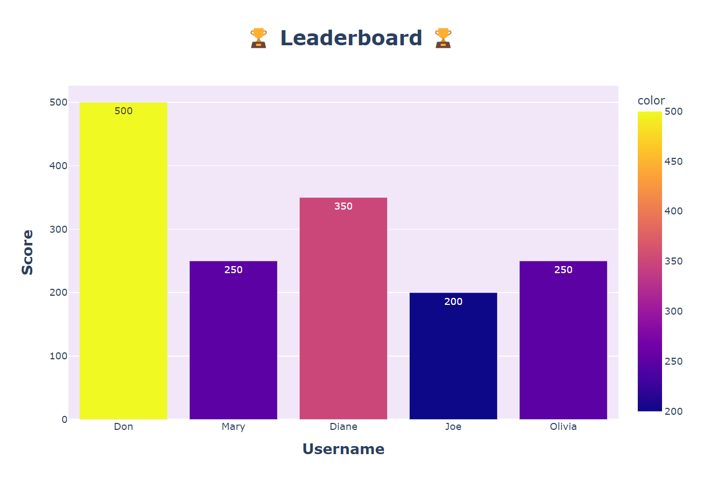

## Rock, Paper, Scissors Game Score Tracker 🪨📃✂️

### A fun Rock, Paper, Scissors game that tracks the scores of all players and ranks them on a Plotly bar chart.

###

#### 📖 Libraries Used: 📖
- ***'random'*** 
- ***'csv'***
- ***'os'***
- ***'plotly.express'***

###

#### 🌟 Features: 🌟  
- Play 5 rounds of Rock, Paper, Scissors  
- First enter a name, then type ***'rock'***, ***'paper'***, ***'scissors'***, ***'help'*** (for instructions), or ***'game'*** (to see the leaderboard)  
- Win = 1 point, Tie = 0.5 points, final score is multiplied by 100  
- Uses CSV file I/O to save and update player scores  
- Displays an interactive Plotly bar chart to visualize player rankings  

#

### ***Leaderboard displaying top scores from the game.***

